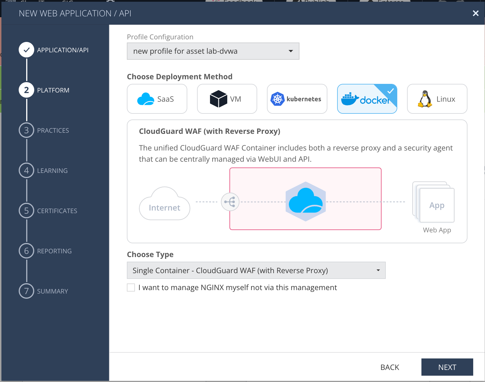

# M02 Lab Agent based

## Deploy CloudGuard WAF Single Gateway in Azure

### Task 1: Create a CloudGuard Profile for Azure gateways

1. Open a Web Browser and open https://portal.checkpoint.com/signin

2. Create an account if you don't have one yet. You should have configured an account in M01-lab-prerequisites section of this guide. Use your credentials to log in to the Infinity Portal.

3. On the left dropdown, go to the "CloudGuard" section and select "WAF". If you haven't started the trial, start it here. 

4. Go to Policy,  select Profiles from the left menu and add an "AppSec Gateway Profile".

5. Fill in the information as shown in the picture below.
a.	Name – lab-waf-vm
b.	Environment – Azure
c.	The Token is automatically generated
d.	Use the publish button to save the changes

| Field                | Value/Action                                 |
|----------------------|----------------------------------------------|
| Name                 | azure-waf-gateways                           |
| Environment          | Azure                                        |
| Token                | Automatically generated                      |

6. Copy the token into Notepad for later use.

7. Save Changes by clicking the **Publish** button in the upper bar

### Task 2: Deploy an WAF Single Gateway in Azure cloud

1. In the Azure portal, go to Azure Marketplace and search for CloudGuard WAF

2. In Plan, select **CloudGuard WAF Single Gateway** and click **Create**

3. Fill in the ARM template form with the following information

**Basics settings**

| Parameter | Value |
|----------|----------|
| Resource group | Select **empty** one (eg ODL-CSA-1939571-02) |
| Region | West US 2 |
| VM Name | labwafvm |
| Authentication type | SSH Public key | 
| SSH Public key source | Use existing public key |
| SSH Public key | ssh-rsa AAAAB3NzaC1yc2EAAAADAQABAAABgQDD4lcNjnTDQolHyGmV0QQUX+VP+OH4pntq+4cm9rGqmtZAqZZ9GMXACVO5Ah8WhDgUscxjGVZEmc0k51GMmFE0u/O6p3sFnAaU/NMyInQm3zkuFI6/jJuN2RwHkY0GYZ5TFuIPwmU3oTGW0s5kE7KA2YFMj//sx1aXqcN0K80EkGlxVfqleKtugpGUmKjgGHc2SPFCtwvzlS0tRFlH1I168P4aYc2rfryFNCO4ifuUHZyVvgPWLb/Oj8+0751iOeDUvDgvtrWSWmTeLVsVpbBgcqy44VIB5JyFzFhAJ/IF2NRyLYeY03UZlqYKYWINVp57E2qgD5j5STQidxcSbC6J93JsmOcv0UfjiHZXigGTDG5t1AjDrYF2ToUtNdJ6o3cyIxMUqHcbs5yikaR3tuecFXNHFs5pMFKh52foKX56LrhWjXhwIlV3PRPzsPh1gCQxODqT7QAnp5dJb46L4yh7/VDcJrCI8VwXmGkErc4dNqIM+UhkVD6sKlvxhAQmm0E= imported-openssh-key |
| Infinity Next Agent Token | Paste token from previous step |   

**Network settings**

| Parameter | Value |
|----------|----------|
| Virtual network | Select **lab-webapp-vnet** |

4. Click **Review + create** & click **Create**

## Deploy CloudGuard WAF Docker container in Azure

### Task 1: Create a CloudGuard Docker Profile

- WAF Agent config - Infinity portal
	- Log in to your Infinity portal tenant and navigate to CloudGuard WAF
	- accept any terms and conditions for the demo period.
	- go to policy > create asset
	- name the asset lab-dvwa
	- the 'user will access the application' URL will be either http://dvwa.lan.local if you're setting it up with a host entry, or something you can setup on your publicly registered domain. This is the public facing entry point to be protected by WAF. 
		- If you are running in a Check Point led session, your instructor can setup public DNS for you.
	- The DNS for this should resolve to the VM public IP (or private IP if you are accessing it within the cloud vNet / VPC). Not the Docker IPs.
	- The last field is where the agent will access the upstream / origin. In this case -it will be http://dvwa
	- 
	- Setup your profile as above per the screenshot.
	- Set webapp and API to prevent mode. API discovery on disabled.
	- accept defaults on following screens and click Done to complete.
	- This should take you to the profile page. From here copy the authentication token and make sure to click 'Enforce' at the top of the window. Make a note of the profile name.
- VM final configuration
	- Back to the VMs SSH session (or restart if timed out) 
	- CD to the cloudguard demo directory
	- run `touch .env`
	- Edit the file with your favourite text editor and add the lines

		```bash
		COMPOSE_PROJECT_NAME=waf-demo
		token=cp-123-123-123-123-123-123-123
		```
		  
		  
	- run `docker compose up -d`
	- Now you should have a VM running with the following ports accessible (ignore the IPs - these might be different in your environment)
	- 
	- Ports 3000, 3001 and 3002 go directly to the vulnerable containers.
	- Port 80 will be protected by CloudGuard WAF.
	- If you go back to the infinity portal - you should see that an agent has successfully connected. This is our Docker container. If you want to inspect the container, you can execute the command 'cpnano -s' to get operational info.
	- Work through some of the vulnerabilities in the DVWA web application. Default login is admin and password. When first accessed, you will need to confirm setting up the database. Ignore any PHP errors.
- Configure additional assets
	- Back to the Infinity Portal and go to the assets page.
	- You will configure two new assets, juiceshop and Vampi
	- Go to Policy > Assets and follow the same procedure as before, but supplying a new name for each asset and a new local host or DNS name.
	- The upstream or origin configuration for the additional hosts is http://juiceshop:3000 and http://vampi:5000 . These hostnames won't be accessible from your linux host directly - but should be resolvable from the CloudGuard WAF container.
	- Set the protection to prevent and when you get to the deployment screen, select the docker standalone profile you created previously. You do not need to deploy a new agent or create a new profile here.
	- Click enforce when finished and you should now be able to access each application through its DNS hostname. 
	- Juice-shop has more challenging vulnerabilities to exploit and Vampi is an API only application. 
	- Before trying to exploit anything on Vampi, go to the relevant asset in the Infinity Portal and enable API discovery. Once enabled, enforce the policy and start browsing around the various paths documented at https://github.com/erev0s/VAmPI
	- **KEEP THIS VM - it's used for the next lab**

